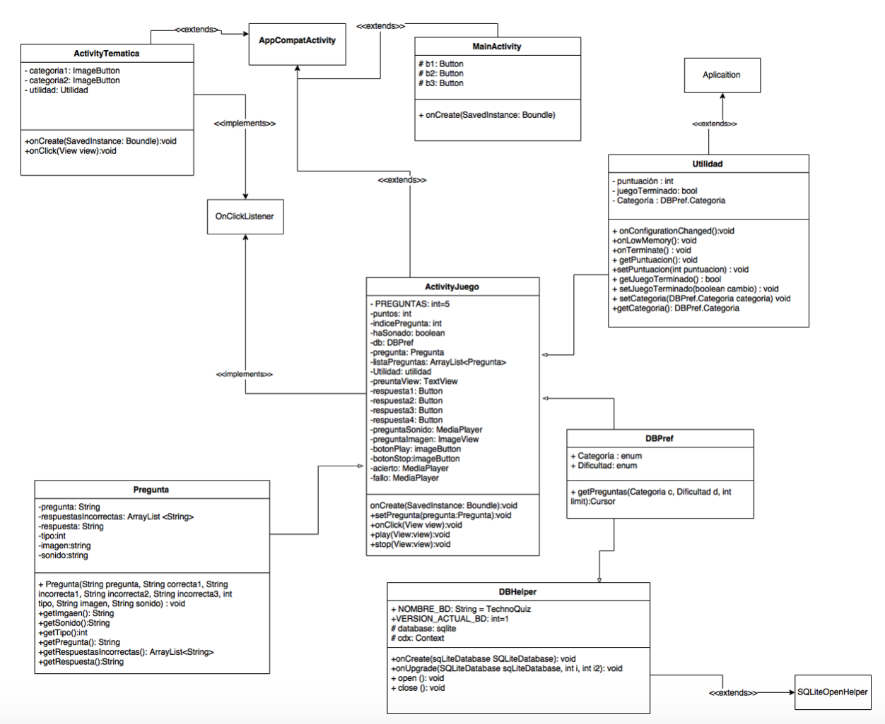

# Desarrollo de Sistemas Software basados en componentes y servicios

# Desarrollo de una App en Android

## 1-Release note:

El sistema ha sido desarrollado con la API de Android 22, aunque es compatible con sistemas de versiones anteriores concretamente desde la API 15. Se ha desarrollado para un tablet de 7 pulgadas aunque el diseño se adapta en la medida de lo posible a dispositivos con distinto tamaño  y resolución de pantalla. 

## 2- Instalación 

El proyecto completo exportado completamente desde AndroidStudio podemos encontrarlo en el siguiente enlace de Dropbox. 

[Descarga en Dropbox](https://www.dropbox.com/s/j4hpp1yi3n2cezi/appCompletaAndroid.zip)

El archivo del código entregado en la entrega, corresponde al repositorio de GitHub usado para el control de versiones durante el proceso de desarrollo de la app, en este zip el .gitignore para Android ha dejado fuera archivos innecesarios por lo que pesa menos.

[Repositorio](https://github.com/joseangeldiazg/technoQuizDSS)

Dicho proceso desarrollo puede ser comprobado en los distintos hitos por los que el proyecto ha pasado. 

[Hitos](https://github.com/joseangeldiazg/technoQuizDSS/milestones?state=closed)

La entrega ofrece un apk (debug) y otro con la versión estable. El debug es más versátil pesa menos y podrá ser probado mejor. Para instalarlos en algún dispositivo deberemos aceptar “Origenes Desconocidos” en nuestro terminal copiar el APK y abrirlo desde alguna app que nos permita ver la estructura de directorios interior de nuestro dispositivo. 

Otra opción para probar la app es  simplemente abrir el código fuente, conectar el dispositivo por un cable USB y ejecutarlo, tras lo cual también se instalará. 

El logo de la aplicación en nuestro dispositivo es un disco de vinilo negro por lo que si el fondo  de nuestro dispositivo es de este color quizá tengamos problemas para verlo. 

## 3-Temática e historia

La aplicación pedida es un juego de preguntas y respuestas para Android. Tras un estudio de mercado sobre las disponibles se ha llevado a cabo el desarrollo de una app relacionada con música electrónica y la historia de la misma. 

Para dotar de cierta emoción, historia y discurso al juego se ha planteado un objetivo el cual es acceder al club berlinés Berghain/Panorama Bar, famoso por la dificultad de acceso y por las preguntas a las que el equipo de seguridad somete a los clientes para poder acceder al mismo. 

El usuario debe responder por tanto antes las preguntas del personaje **“Sven”** y tras finalizar este decidirá sobre si el usuario finalmente puede acceder al club o no en función del número de preguntas acertadas o falladas. 

Esta temática ha llevado por tanto a un cambio en uno de los requisitos de la app pedidos por el cliente, que en lugar de mostrar juegos relacionados (no los hay) y dada la temática especializada del tema en cuestión, mostrará con WebView algunas webs especializadas en música en las que podremos obtener ayuda para resolver el quiz. 

## 4-Análisis de Requisitos mínimos de la app

La aplicación por petición del cliente satisface los siguientes requisitos:

Funcionales:

-El juego deberá mostrar una batería de preguntas.

-El usuario ha de poder responder a las preguntas de una en una.

-Si el usuario falla la pregunta, se le mostrará un mensaje indicándole que ha fallado junto con un sonido

-Si el usuario acierta, se le muestra un mensaje indicándole que ha acertado.

-Ha de haber pantallas de pregunta que incluyan 1 imagen.

-Si el usuario falla, entonces deberá aparecer la opción de continuar la partida o de volver a iniciar el juego.

-Si el usuario acierta, continuará con la siguiente pregunta.

-Cuando el usuario finaliza la partida, se le muestran los resultados que ha obtenido.

-El menú deberá poder dirigirnos, al inicio de una nueva partida, a una opción que nos permita ver los resultados obtenidos en las partidas realizadas anteriormente, o a otros juegos en la Red mediante un webView.

No Funcionales:

-Solamente puede hacerse un único acceso a la base de datos.

-La aplicación deberá funcionar como mínimo en dispositivos con versiones de sistemas
operativos actuales ( por ejemplo: Android >=4.4)

-La aplicación debe funcionar tanto en dispositivos móviles (teléfonos) como en tablets.

-Se debe desarrollar la aplicación pedida aplicando Patrones de Diseño Software (por ejemplo: Singleton, Inmutable, Proxy, Escuchador de Eventos ) y Patrones Arquitectónicos (por ejemplo: MVC, DataBaseManagement System).

## 5-Requisitos funcionales extras en la app

La aplicación ademas de los requisitos mínimos vistos anteriormente ofrece mejoras de visualización y funcionalidad tales como las siguientes:

-Antes de iniciar el juego se da la opción al jugador de elegir la temática sobre el mismo, Historia de la música electrónica o Artistas. 

-La vista de estadísticas ofrece un gráfico de sectores detallado visual en lugar de unas simples estadísticas. 

-Si accedemos a Estadísticas antes de empezar el juego, “Sven” nos dirá que debemos contestar primero. Si hemos acabado en función de nuestros resultados nos ofrecerá un comentario u otro dotando de dinamismo la app. 

## 6-Diagrama de clases.

El diagrama de clases UML del sistema entregado puede verse en la siguiente imagen. 

